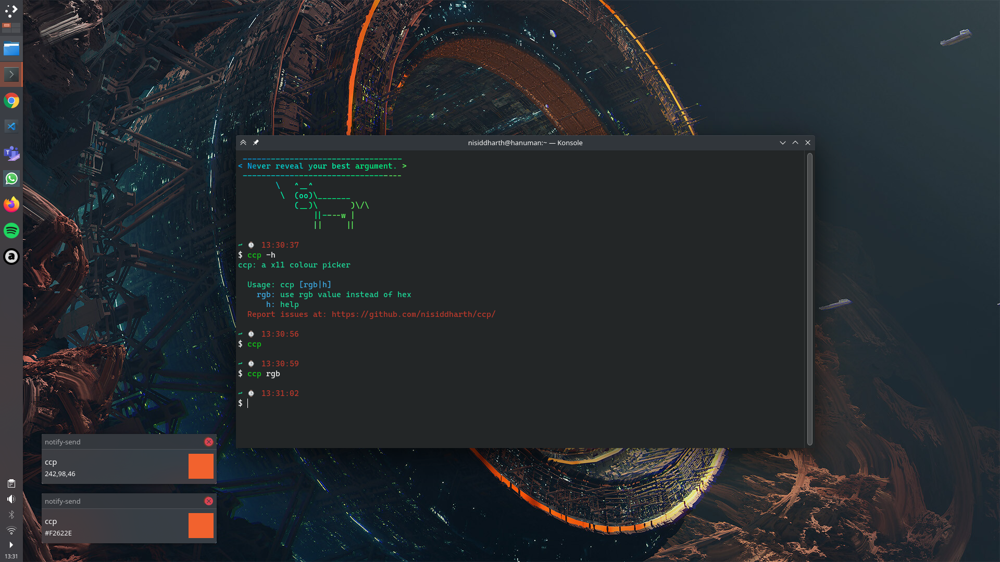

# CCP Colour Picker

An X11 colour picker tool.

<p align="center">
  
</p>

The CCP Colour Picker (CCP) is a simple colour picker for X11 in POSIX which uses `xdotool` to get mouse position, `convert` for getting colour values, and `xclip` to copy it to clipboard.

## Dependencies

```bash
xdotool
ImageMagick
xclip
```

## Install

Copy [`ccp`](ccp) to `~/.local/bin/`, like so:

```bash
curl https://raw.githubusercontent.com/nisiddharth/ccp/main/ccp > ~/.local/bin/ccp
```

For further ease of use you can create a keyboard shortcut to run `ccp`.

## Usage

```
    Usage: ccp [rgb|h]
    rgb: use rgb value instead of hex
      h: help
```

## Example

```bash
ccp
```
